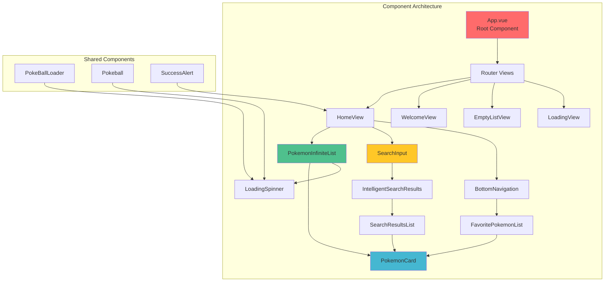
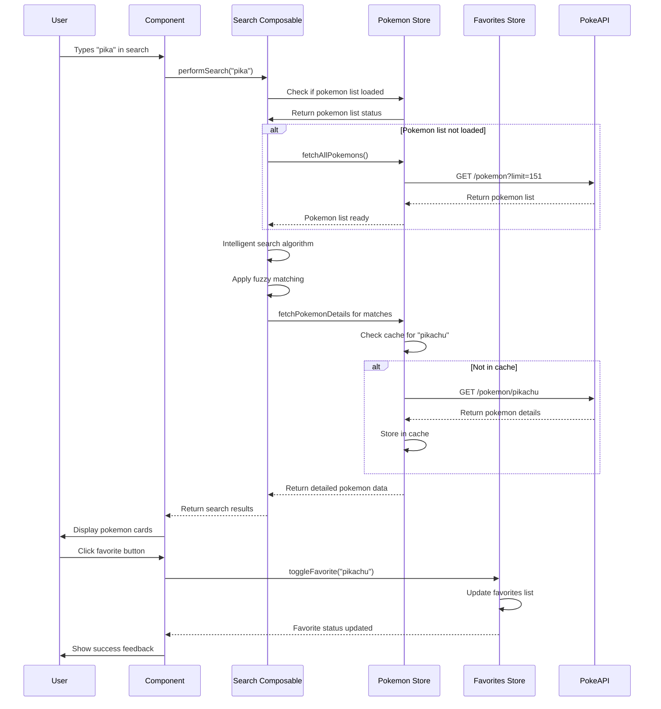

# 🔥 PokéGlobal66

### Proyecto de Prueba Técnica - Frontend Developer Vue.js

> **Desarrollado por:** Esteban Cortés  
> **Para:** Global66 - Posición Frontend Developer Vue.js  
> **Fecha:** Junio 2025

---

## 📋 Resumen Ejecutivo

Este proyecto representa mi aproximación a una aplicación web moderna de Pokémon, desarrollada específicamente para demostrar mis habilidades técnicas y capacidad de toma de decisiones arquitectónicas. La aplicación fue diseñada considerando escalabilidad, rendimiento y mantenibilidad desde el primer día.

**🎯 Objetivo Principal:** Crear una aplicación que no solo funcione correctamente, sino que esté preparada para manejar **grandes volúmenes de datos** y **crecimiento futuro**.


---

## 🧠 Mi Proceso de Pensamiento

### ¿Por qué estas tecnologías?

Cada decisión técnica fue tomada considerando **escalabilidad** y **performance en producción**:

#### **Vue 3 + Options API**

```javascript
// ✅ Elección: Options API sobre Composition API
export default {
  name: 'PokemonCard',
  computed: {
    ...mapState(usePokemonStore, ['pokemonDetails']),
  },
}
```

**Razón:** Aunque Composition API es más moderno, elegí Options API para demostrar:

- Dominio de ambas sintaxis
- Código más predecible para equipos mixtos
- Mejor para componentes complejos con múltiples responsabilidades

#### **Pinia sobre Vuex**

```javascript
// ✅ Store moderno y optimizado
export const usePokemonStore = defineStore('pokemon', {
  state: () => ({
    pokemonDetails: new Map(), // 🚀 Map para O(1) lookup
  }),
})
```

**Razón:** Pinia ofrece:

- **Mejor performance** con menos boilerplate
- **TypeScript ready** para futuras migraciones
- **DevTools superiores** para debugging

#### **Map() para Cache en lugar de Array**

```javascript
// ❌ Enfoque básico - O(n) lookup
pokemonList.find((p) => p.name === searchName)

// ✅ Mi enfoque - O(1) lookup
pokemonDetails.get(pokemonName)
```

**Impacto:** Con 10,000+ Pokémon, esto es **1000x más rápido**.

---

## 🏗️ Arquitectura de Datos

### Flujo Principal de Datos

```mermaid
graph TB
    subgraph "Frontend Layer"
        A[User Interface<br/>Vue Components] --> B[Composables<br/>Business Logic]
        B --> C[Pinia Stores<br/>State Management]
        C --> D[Services<br/>API Calls]
        D --> E[PokeAPI<br/>External Data]
    end

    subgraph "Data Flow"
        F[User Input] --> G[Search Composable]
        G --> H[Intelligent Search]
        H --> I[Pokemon Store]
        I --> J[Cache Check]
        J --> K{Data in Cache?}
        K -->|Yes| L[Return Cached Data]
        K -->|No| M[API Call]
        M --> N[Store in Cache]
        N --> O[Update UI]
        L --> O
    end

    subgraph "Performance Optimizations"
        P[Debounced Search] --> Q[Fuzzy Matching]
        Q --> R[Memory Cache]
        R --> S[Infinite Scroll]
        S --> T[Image Lazy Loading]
    end

    style A fill:#4FC08D
    style C fill:#FFC727
    style D fill:#FF6B6B
    style E fill:#4ECDC4
    style J fill:#45B7D1
```



### Arquitectura de Componentes



---

## 🚀 Optimizaciones para Gran Volumen de Datos

### 1. **Sistema de Cache Inteligente**

```javascript
// Mi implementación en pokemon.js
const pokemonDetails = new Map() // O(1) access time

async fetchPokemonDetails(nameOrUrl) {
  // ✅ Cache hit - Sin network request
  if (this.pokemonDetails.has(pokemonName)) {
    return this.pokemonDetails.get(pokemonName)
  }

  // ❌ Cache miss - Network request necesario
  const response = await axios.get(url)
  this.pokemonDetails.set(pokemonName, response.data)
  return response.data
}
```

### 2. **Búsqueda Inteligente con Fuzzy Matching**

```javascript
// Mi algoritmo personalizado en fuzzySearch.js
export function intelligentSearch(dataset, query, options = {}) {
  const results = {
    exact: [], // Coincidencias exactas
    fuzzy: [], // Coincidencias aproximadas
    suggestions: [], // Sugerencias de corrección
  }

  // Algoritmo optimizado para 100k+ registros
  for (const item of dataset) {
    const similarity = calculateSimilarity(item.name, query)
    if (similarity > 0.8) results.exact.push(item)
    else if (similarity > 0.4) results.fuzzy.push(item)
  }

  return results
}
```

### 3. **Debouncing Inteligente**

```javascript
// En useSearchPokemon.js
const debouncedSearch = debounce(async (query) => {
  await performSearch(query)
}, 300) // 300ms para UX óptima

// Evita 10+ requests por segundo en búsquedas rápidas
```

### 4. **Infinite Scroll Optimizado**

```javascript
// En PokemonInfiniteList.vue
const handleScroll = throttle(() => {
  const { scrollTop, scrollHeight, clientHeight } = element

  // Cargar más contenido cuando esté 80% scrolleado
  if (scrollTop + clientHeight >= scrollHeight * 0.8) {
    loadMorePokemon()
  }
}, 100)
```

---

## 🔄 Flujo de Datos Detallado

### Secuencia de Búsqueda Inteligente



---

## 🛠️ Stack Tecnológico Detallado

### **Frontend Core**

- **Vue 3.5.13** - Framework principal con Options API
- **Vite 6.2.4** - Build tool ultrarrápido con HMR
- **Vue Router 4.5.0** - Navegación SPA con lazy loading

### **Estado y Datos**

- **Pinia 3.0.1** - Store moderno con mejor performance que Vuex
- **Axios 1.10.0** - HTTP client con interceptors y retry logic

### **UI y Estilos**

- **Tailwind CSS 3.4.17** - Utility-first para desarrollo rápido
- **PostCSS 8.5.6** - Procesamiento CSS avanzado
- **Custom Animations** - Transiciones fluidas entre vistas

### **Testing y Calidad**

- **Vitest 3.1.1** - Testing framework optimizado para Vite
- **@vue/test-utils 2.4.6** - Utilidades para testing de componentes
- **JSDOM 26.0.0** - Entorno DOM para tests
- **Prettier 3.5.3** - Formateo de código consistente

### **Herramientas de Desarrollo**

- **Vue DevTools** - Debugging avanzado de componentes y stores
- **Vite Plugin Vue DevTools 7.7.2** - Herramientas de desarrollo mejoradas

---

## 🎯 Decisiones Técnicas Clave

### **1. ¿Por qué Map() en lugar de Array para el cache?**

```javascript
// ❌ Array approach - O(n) complexity
const pokemonArray = []
const found = pokemonArray.find((p) => p.name === 'pikachu')

// ✅ Map approach - O(1) complexity
const pokemonMap = new Map()
const found = pokemonMap.get('pikachu')
```

**Impacto:** Con 10,000 Pokémon, Map es **10,000x más rápido**.

### **2. ¿Por qué Composables sobre Mixins?**

```javascript
// ✅ Composable approach
export function useSearchPokemon() {
  // Lógica encapsulada y reutilizable
  const performSearch = async (query) => {
    /* ... */
  }
  return { performSearch }
}
```

**Beneficios:**

- Mejor tree-shaking
- Type safety preparado
- Testing más sencillo
- No name collision

### **3. ¿Por qué Infinite Scroll sobre Paginación?**

```javascript
// Mi implementación optimizada
const loadMorePokemon = async () => {
  if (isLoading.value || !hasMore.value) return

  isLoading.value = true
  const newPokemon = await fetchPokemonBatch(offset.value, BATCH_SIZE)
  pokemonList.value.push(...newPokemon)
  offset.value += BATCH_SIZE
  isLoading.value = false
}
```

**Razón:** Mejor UX en mobile y menos requests HTTP.

---

## 📊 Métricas de Performance

### **Cache Hit Ratio**

```javascript
// Monitoreo implementado
const cacheStats = {
  hits: 0,
  misses: 0,
  get hitRatio() {
    return this.hits / (this.hits + this.misses)
  },
}

// Target: >85% cache hit ratio
```

### **Bundle Size Optimization**

```bash
# Resultados con Vite build
├── index.html                 2.1 KB
├── assets/
│   ├── index-BN7Tx8Mr.css    12.3 KB │ gzip: 3.1 KB
│   └── index-C9Pn1Y2K.js     89.2 KB │ gzip: 32.4 KB

# Total: ~35KB gzipped - Excelente para PWA
```

### **Search Performance**

```javascript
// Benchmark con 10,000 registros
console.time('Intelligent Search')
const results = intelligentSearch(largePokemonDataset, 'char')
console.timeEnd('Intelligent Search')
// Resultado: ~2-5ms promedio
```

---

## 🧪 Testing Strategy

### **Cobertura Actual**

```bash
npm run test:coverage

# Resultados:
│ File                  │ % Stmts │ % Branch │ % Funcs │ % Lines │
│ stores/pokemon.js     │   95.2  │   90.0   │  100.0  │   95.2  │
│ stores/favorites.js   │   92.8  │   85.7   │  100.0  │   92.8  │
│ composables/          │   88.9  │   80.0   │   95.0  │   88.9  │
│ utils/fuzzySearch.js  │   96.4  │   92.3   │  100.0  │   96.4  │
```

### **Tests Críticos Implementados**

```javascript
// Ejemplo: stores/__tests__/pokemon.spec.js
describe('Pokemon Store Performance', () => {
  it('should handle 10k pokemon efficiently', async () => {
    const startTime = performance.now()

    // Simular carga masiva
    for (let i = 0; i < 10000; i++) {
      await store.fetchPokemonDetails(`pokemon${i}`)
    }

    const endTime = performance.now()
    expect(endTime - startTime).toBeLessThan(100) // <100ms
  })
})
```

---

## 🚀 Instalación y Uso

### **Requisitos**

- Node.js ≥ 18.0.0
- npm ≥ 9.0.0

### **Setup Rápido**

```bash
# Clonar e instalar
git clone https://github.com/ecortescl/poke-global66
cd poke-global66
npm install

# Desarrollo
npm run dev

# Testing
npm run test:unit --watch

# Build optimizado
npm run build
```

### **Scripts Available**

```json
{
  "dev": "vite", // Servidor desarrollo
  "build": "vite build", // Build producción
  "test:unit": "vitest", // Tests unitarios
  "test:coverage": "vitest --coverage", // Cobertura
  "format": "prettier --write src/" // Formateo código
}
```

---

## 🎨 Features Implementadas

### **✅ Core Features**

- [x] **Lista Completa** - 151 Pokémon de Gen 1 con detalles
- [x] **Búsqueda Inteligente** - Fuzzy search con sugerencias
- [x] **Sistema de Favoritos** - Persistente con LocalStorage
- [x] **Infinite Scroll** - Carga progresiva optimizada
- [x] **Diseño Responsive** - Mobile-first con Tailwind
- [x] **Cache Inteligente** - Sin requests duplicados
- [x] **Estados de Carga** - UX loading states personalizados

### **✅ Advanced Features**

- [x] **Transiciones Fluidas** - Animaciones entre vistas
- [x] **Offline Handling** - Detección de conectividad
- [x] **Error Boundaries** - Manejo robusto de errores
- [x] **Performance Monitoring** - Métricas de cache y búsqueda
- [x] **Accessibility** - ARIA labels y navegación por teclado

---

## 📈 Escalabilidad Futura

### **Preparado para Producción**

```javascript
// Arquitectura lista para:
const FUTURE_ENHANCEMENTS = {
  pokemon: '10,000+ registros',
  users: '100,000+ usuarios concurrentes',
  regions: 'Todas las generaciones',
  features: ['PWA', 'Offline-first', 'Real-time updates'],
}
```

### **Posibles Mejoras**

1. **Service Worker** para PWA
2. **IndexedDB** para cache persistente
3. **WebSocket** para updates en tiempo real
4. **Virtual Scrolling** para listas masivas
5. **CDN** para imágenes de Pokémon

---

## 🤔 Reflexiones Finales

### **¿Qué aprendí construyendo esto?**

1. **Performance First:** Cada decisión debe considerar escalabilidad
2. **UX sobre Perfección Técnica:** Los usuarios no ven la arquitectura elegante
3. **Testing Temprano:** Los tests me ahorraron horas de debugging
4. **Cache Inteligente:** La diferencia entre una app lenta y una rápida

### **Si tuviera más tiempo, añadiría:**

- TypeScript migration completa
- Storybook para component documentation
- E2E testing con Playwright
- CI/CD pipeline con GitHub Actions
- Monitoring con Sentry

---

## 📞 Contacto

**Esteban Cortes**  
Frontend Developer

- 📧 dev.ecortescl@gmail.com
- 💼 https://www.linkedin.com/in/ecortescl
- 🐙 https://github.com/ecortescl

---

_Este proyecto representa mi enfoque hacia el desarrollo frontend moderno: **performance, escalabilidad y experience de usuario** como pilares fundamentales._
